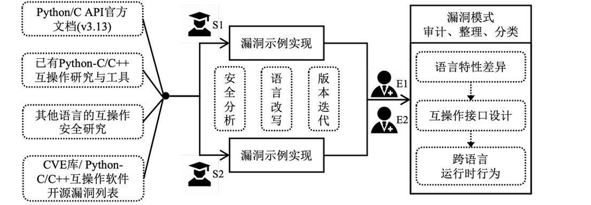
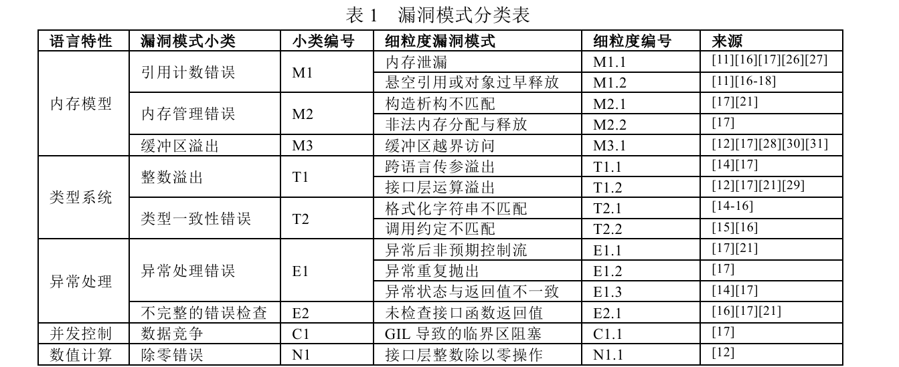
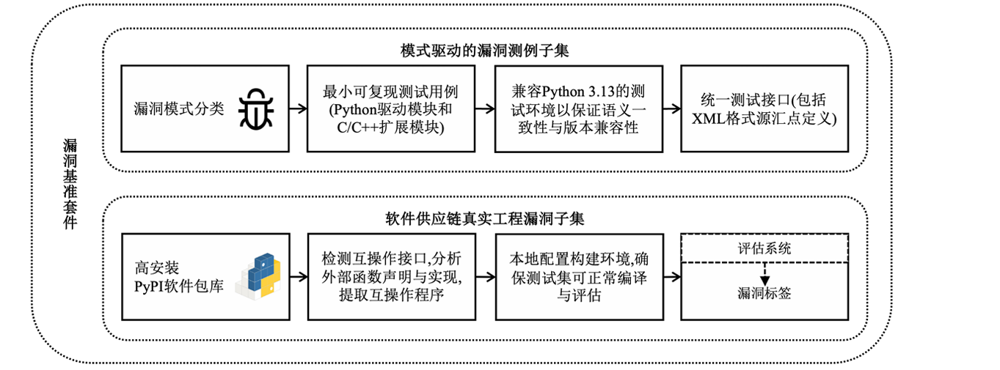
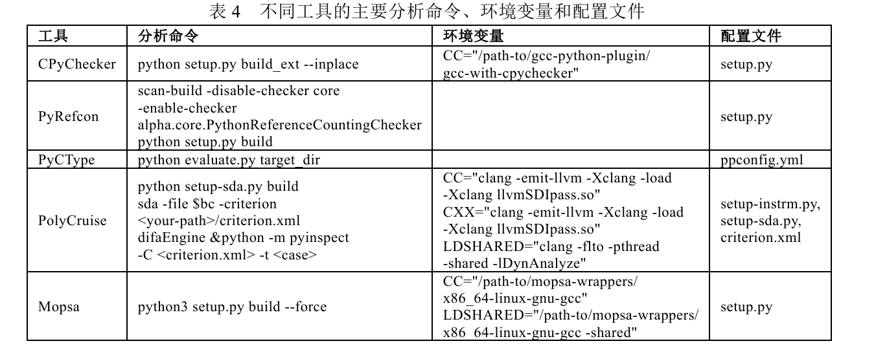

## Benchmark基本介绍
该项目由两个项目构成，分别是**pattern-driven (模式驱动的漏洞测例子集)**和**real-supplychain(软件供应链真实工程漏洞子集)**。
以及试验评估中发现的实际漏洞bug_find.md

## pattern-driven(模式驱动的漏洞测例子集)
漏洞测例子集时混合了以下四个来源: (1) Python 3.13 版本Python/C API官方文档, (2)已有的Python-C/C++跨语言互操作安全性分析研究和工具, (3)已有的其他语 
言互操作安全性研究, (4) CVE库及Python-C/C++互操作软件开源漏洞列表

  
如下图所示共计存在13类细粒度漏洞模式

## real-supplychain(软件供应链真实工程漏洞子集)

通过入上图的操作，我们最终得到 16 个安装量排名前列且实际包含 Python/C API 调用的
PyPI 软件包,这些项目具有代表性且在Python软件供应链中使用广泛.除了用于编写C/C++扩展, Python/C API
还可以用于将Python运行时嵌入C/C++程序以实现C/C++-Python调用,这种用法在Python软件供应链中非常
少见.安装量最高的 16 个 PyPI 互操作包及上述漏洞测例子集都是 Python 调用 C/C++的情形,其中允许通过
PyObject_Call 等 Python/C API 函数由 C/C++侧回调 Python 对象.

## 相关测试工具
